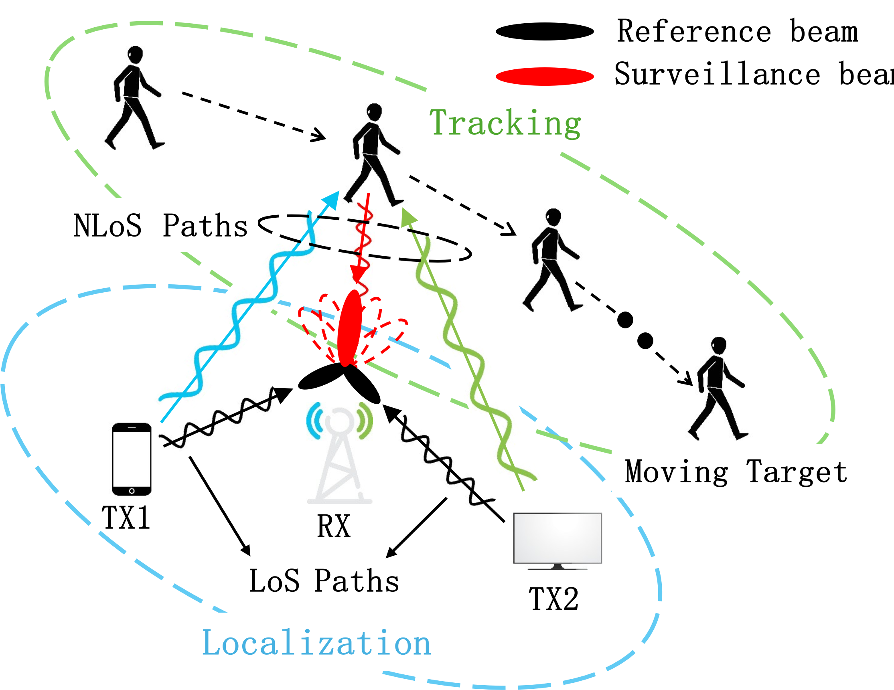
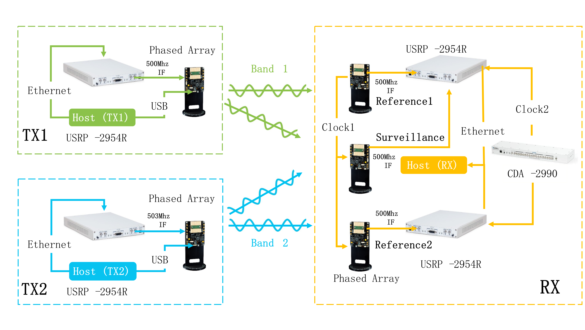
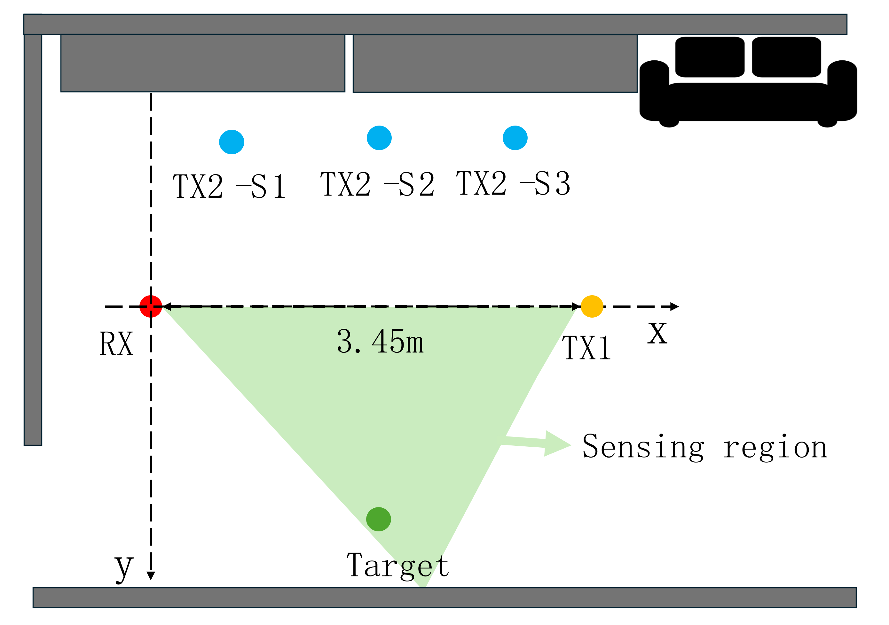

# mmAlert
## Overview
The mmAlert dataset contains experimental data for simultaneous device localization and passive target tracking using 60GHz mmWave OFDM signals. This dataset is intended for investigating the reconstruction of passive moving target trajectories via half-duplex communication systems without prior knowledge of transceiver locations.
<p align="center">
    <!---->
     <br>
</p>

## Keywords
Localization, trajectory reconstruction, cooperative passive sensing, 60GHz mmWave

## Experiment Setup
<p align="center">
    <!---->
     <br>
</p>

- Transceiver: NI USRP-2954R software defined radio (SDR) and Sivers 60GHz phased array.

- Moving Target: Turltebot 4 Lite / Human.

- Carrier Frequency: 60.98GHz (transmitter 1) and 60.983GHz (transmitter 2). 

- Intermediate Frequency: 500MHz (transmitter 1) and 503MHz (transmitter 2). 

- Bandwidth: 1MHz.

- Sampling Frequency: 5MHz.


## Instructions
<p align="center">
    <!---->
     <br>
</p>
The dataset features 150 trajectory recordings of passive moving target across three scenarios, with Transmitter 1 stationary and Transmitter 2 at three unique locations per scenario. It consists of following components: 

- The received signal for each recording (\*.dat)

- The ground-truth trajectory of Turtlebot (\*.tum)

**How to Use the Dataset：**

***Step 1.*** Download dataset
  - Due to its large size, the dataset cannot be directly uploaded to GitHub. Please download it from the following link: [Downloads mmAlert Dataset](http://gofile.me/63niY/SeoKQ6yio)
  
***Step 2.*** Load data into your own program
  - The following example demonstrates how to read the data in a Python environment:
```python
# Example: read a .dat file and corresponding trajectory
import numpy as np

channelNum = 3
def DataRead(filename = 'path/to/recording_001.dat'):
	data_complex = np.fromfile(filename, dtype=np.complex64, count=-1)
	data_sample = data_complex.reshape(-1, channelNum, order="F")
	data_sample = np.transpose(data_sample)
	return data_sample
	
# Load received signal
signal_data = DataRead('path/to/recording_001.dat')

# Load ground-truth trajectory
trajectory = np.loadtxt('path/to/trajectory_001.tum')
```

## License
This dataset is licensed under the Creative Commons Attribution 4.0 License. You are free to use, share, and adapt the data, provided that proper attribution is given.

## Contact
For questions, please contact:
- Chao Yu: 12431241@mail.sustech.edu.cn
